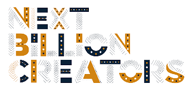

# Open Source Resources

A community-generated pool of opensource resources useful for engineers/developers intrested in contributing to opensource. If you are new, join us on [Discord](https://discord.gg/XP3gy6V9) and [Telegram](https://t.me/oscanairobi)

Contributing to open-source projects has proved to be an excellent way to learn as a developer. To test and share knowledge with other coders. With each contribution, you gain experience. 

The OSCA -Nairobi has put together a repository that can help you contribute to opensource. Projects of all languages, platforms and levels of difficulty. 

## **Contents**
- [Why contribute to Open Source](#why-contribute-to-opensource)
- [Pre-requisites](#pre-requisites)
- [Finding beginner-friendly projects](#finding-beginner-friendly-projects)
- [First-timers](#first-timers)
- [ Direct Search on GitHub](#direct-search-on-github)
- [Platforms to contribute on](#other-platforms)
- [Sample Projects](#sample-projects)

## Deep-Dive
- [A quick intro to open source, github and git](https://github.com/OSCA-Nairobi/OpenSourceResources/tree/main/first_timers)
- [Books. articles and open source initiatives to hep you out](https://github.com/OSCA-Nairobi/OpenSourceResources/blob/main/resources/Resources.md)

## Why contribute to opensource

### Social and organizational skills
- Developing a sense of context: understanding how development work is embedded within a project's scope, mission, team of co-developers, and new forms of leadership;
- Interacting with a project's global and diverse community;
- Negotiating feature requests, requirements, and implementation choices;
- Dealing with communication problems, such as absent responses, which are common in volunteer-run projects;
- Appreciating the software as a product through practices such as issue triaging and release planning; and
- Receiving, discussing, and addressing code review comments.
### Tech skills
- Navigating through a project's assets, such as software code, issues, documentation, and pull requests;
- Evaluating swiftly the product and process quality of software systems or components, as is often required in modern software reuse;
- Configuring, building, running, and debugging third-party code;
- Setting up and running software intensive systems with diverse software and hardware requirements. In the course I run, these have included mobile phones, car electronics, application servers, databases, containers, IoT equipment, and embedded devices;
- Choosing realistic contribution goals. (Initially students tend to wildly overestimate their ability to contribute to a project.) This is a key activity in agile development sprints;
- Reading third-party code to identify where their additions or fixes need to be made;
- Modifying a large third-party system by adding a new feature or fixing a bug;
- Writing tests that demonstrate a contribution is working as expected now and into the future;
- Working with software systems developed using multiple programming languages and tools; students are often surprised to find out that knowledge of an Integrated Development Environment (IDE) is by no means a passport for contributing to a project;
- Documenting their work, typically using a declarative markup language, for example Markdown or documentation generator code comments;
- Following sophisticated configuration management (version control) workflows, such as working on issue branches and rebasing code commits; and
- Passing pre-commit and continuous integration checks and tests.

## Pre-requisites
This assumes that you are familiar with using version control. That you have a solid understanding of a programming language. If you are new, I suggest this link to help you better grasp git and GitHub. 

## Finding beginner-friendly projects
- Check for labels: Open source projects have labels that you can use to identify projects.
- Lists
- Resources: Listed below are projects that you can contribute to. 

## First-timers
[Here](https://github.com/firstcontributions/first-contributions) is a guide to help guide you on how to make your first contribution. You can also read it in other languages. 
- A few more places to get started
   - [Code Triage](https://www.codetriage.com/)
   - [Up for Grabs](https://up-for-grabs.net/#/)
   - [First Timers Only](https://www.firsttimersonly.com/)
   - [Open Source Friday](https://opensourcefriday.com/)
 
 ## Direct Search on GitHub
 
 OS maintainers tend to label issues on their GitHub projects. This is easier for reach and for contributers to find out which projects are suitable to contribute to. 
 - [is:issue is:open label:beginner](https://github.com/search?q=is%3Aissue+is%3Aopen+label%3Abeginner&type=issues)
- [is:issue is:open label:easy](https://github.com/search?q=is%3Aissue+is%3Aopen+label%3Aeasy&type=issues)
- [is:issue is:open label:first-timers-only](https://github.com/search?q=is%3Aissue+is%3Aopen+label%3Afirst-timers-only&type=issues)
- [is:issue is:open label:good-first-bug](https://github.com/search?q=is%3Aissue+is%3Aopen+label%3Agood-first-bug&type=issues)
- [is:issue is:open label:"good first issue"](https://github.com/search?q=is%3Aissue+is%3Aopen+label%3A%22good+first+issue%22&type=issues)
- [is:issue is:open label:starter](https://github.com/search?q=is%3Aissue+is%3Aopen+label%3Astarter&type=issues)
- [is:issue is:open label:up-for-grabs](https://github.com/search?q=is%3Aissue+is%3Aopen+label%3Aup-for-grabs&type=issues)

 ## Other platforms
 You can also find projects to contribute to through other platforms

   1. *[Google Open Source](https://opensource.google/)*
   2. *[FaceBook Open Source](https://opensource.fb.com/?1)*
   3. *[Mozilla](https://github.com/OSCA-Nairobi/OpenSourceResources/edit/main/README.md#why-contribute-to-opensource)* - Has a couple of resources;
          
- [Good First Bugs](https://bugzil.la/sw:%22[good%20first%20bug]%22&limit=0) - bugs that developers have identified as a good introduction to the project.
- [MDN Web Docs](https://developer.mozilla.org/en-US/docs/MDN/Contribute)              - help the MDN Web Docs team in documenting the web platform by fixing content issues and platform bugs.
- [Mentored Bugs](https://bugzilla.mozilla.org/buglist.cgi?quicksearch=mentor%3A%40) - bugs that have a mentor assigned who will be there on IRC to help you when you get stuck while working on a fix.
- [Bugs Ahoy](https://www.joshmatthews.net/bugsahoy/) - a site dedicated to finding bugs on Bugzilla.
- [Firefox DevTools](http://firefox-dev.tools/) - a site dedicated to bugs filed for the developer tools in the Firefox browser.
- [What Can I Do For Mozilla](https://whatcanidoformozilla.org/) - figure out what you can work on by answering a bunch of questions about your skill set and interests.
- [Start Mozilla](https://twitter.com/StartMozilla) - a Twitter account that tweets about issues fit for contributors new to the Mozilla ecosystem.
         

## Sample Projects
| Project             |  Language |   Description                                    | Link                                                          |
| ------------------  | ----------- |------------------------------------------------|---------------------------------------------------------------|
| Neovim              | C           |  Vim-fork focused on extensibility and agility.|  https://github.com/neovim/neovim/labels/good%20first%20issue |
| Cake            | C#       |        Cake (C# Make) is a free and open-source cross-platform build automation system with a C# DSL for tasks such as compiling code, copying files and folders, running unit tests, compressing files and building NuGet packages  |   https://github.com/cake-build/cake/labels/Good%20first%20issue  |
| Godot Engine           | C++     |        2D and 3D cross-platform game engine. Also has C# and Python code.  |   https://github.com/godotengine/godot/labels/junior%20job |
| projectM            | C++     |       A music visualizer library using OpenGL and GLSL. Has applications using Qt5, SDL, emscripten, iTunes, Kodi.  |   https://github.com/projectM-visualizer/projectm/labels/good%20first%20issue |
| tensorflow           | C++     |      Computation using data flow graphs for scalable machine learning  |  https://github.com/tensorflow/tensorflow/labels/stat%3Acontributions%20welcome |
| sButtons          | CSS     |      Simple buttons you can easily use for your next project.  | https://github.com/shahednasser/sbuttons/labels/good%20first%20issue|
| Moby           | Go     |      Open-source application container engine| https://github.com/moby/moby/labels/exp%2Fbeginner|
| Killgrave         | Go     |      Simple way to generate mock servers in Go.| https://github.com/friendsofgo/killgrave/labels/good%20first%20issue|
| Strongbox          | Java    |      Strongbox is an artefact repository manager written in Java. | https://github.com/strongbox/strongbox/labels/good%20first%20issue|
|Wikimedia Commons Android App          | Java & Kotlin     |     Allows users to upload pictures from their Android phone/tablet to Wikimedia Commons. |https://github.com/commons-app/apps-android-commons/labels/good%20first%20issue|
| SirixDB           |Java     |      SirixDB is an evolutionary, versioned NoSQL document store (XML and JSON) written (mostly) in Java. It stores compact snapshots during commits with many concepts borrowed from ZFS and Git. Each revision is indexed and the document store can be queried with temporal queries. It's especially well suited for modern hardware. | https://github.com/sirixdb/sirix/labels/good%20first%20issue|
| Leaflet         | JavaScript     |      JavaScript library for mobile-friendly interactive maps. | https://github.com/Leaflet/Leaflet/labels/good%20first%20issue|
| Adobe Brackets          | JavaScript     |      An open-source code editor for the web, written in JavaScript, HTML and CSS. | https://github.com/adobe/brackets/issues?q=is%3Aopen+is%3Aissue+label%3A%22starter+bug%22|
| Kotlin Libraries Playground        | Kotlin     |      A playground to gain a wider and deeper knowledge of the libraries in the Kotlin ecosystem. Also the official sample for gradle refreshVersions. | https://github.com/LouisCAD/kotlin-libraries-playground/labels/good%20first%20issue|
|CiviWiki     | Python     |      Building a Better Democracy for the Internet Age | https://github.com/CiviWiki/OpenCiviWiki/labels/good%20first%20issue|
|Jupyter notebook      | Python     |     Jupyter interactive notebook. | https://github.com/jupyter/notebook/labels/good%20first%20issue|
|Zulip      | Python     |   Powerful open source group chat. |https://github.com/zulip/zulip/labels/good%20first%20issue|

Didn't see a project you would like others to contribute to? [*Check this out on how to submit one*](https://github.com/OSCA-Nairobi/OpenSourceResources/blob/main/submit_project/SUBMIT_PROJECT.md)

### Help Us Help All
We can only improve and add value by working together with our community. Please help us iterate on our processes so that we can grow this program to enrich the larger engineering community. If you see something that needs attention, please submit an issue so we can address it in a timely manner.
